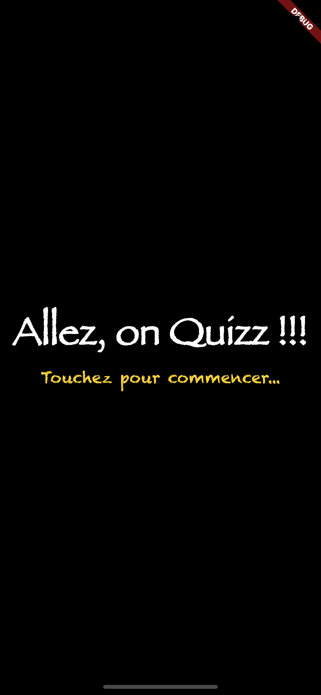
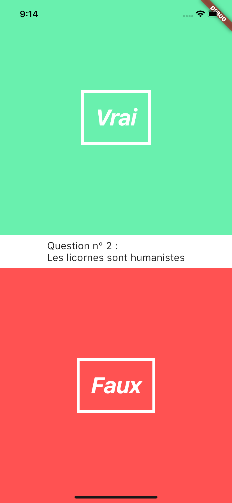
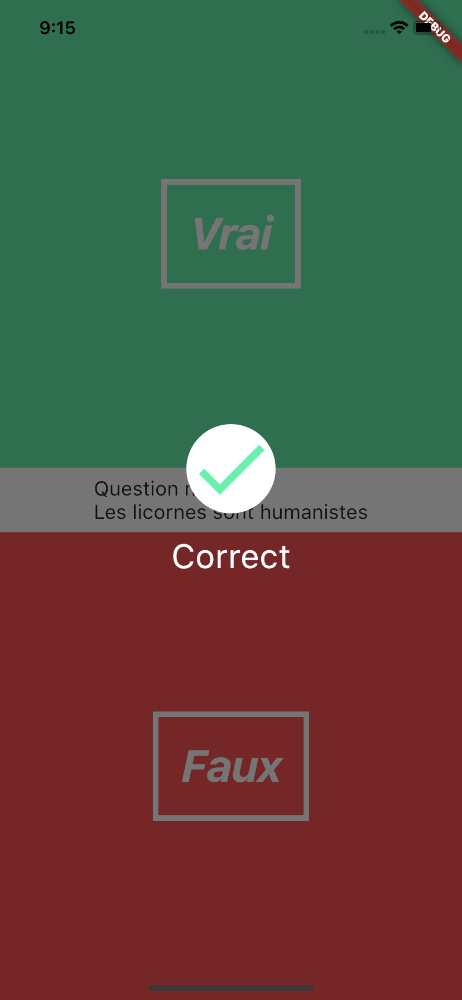

# quizzFlutter

Un petit projet en Flutter.
Ce projet est destiné à évoluer et adopter plus de connectivité.
Il est basé sur un tutoriel de Bram Vanbilsen.

## A quoi ça ressemble?

### Une page d'accueil

### Une question

### Une validation

